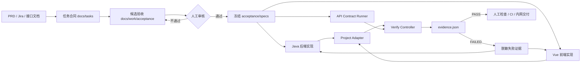

# Loop Engineering 全栈实施手册

> 适用范围：企业内网、半离线或完全离线环境中的 OpenCode + Java/Spring Boot + Vue 全栈开发。
>
> 本手册把“需求文档 → API 与前端验收 → Java/Vue 实现 → 外部验证 → 失败回流 → CI/内网交付”串成一条可以重复执行的工程流程。它参考配套 PDF 中的 SDD、Harness 和 Loop 思想，并以仓库已有的 Verify Controller、Acceptance Contract、Project Adapter 和 OpenCode Skills 为落点。

本文不是“给模型写一段万能提示词”。核心分工是：模型负责执行，外部验证器负责判定，人的工作是定义问题、冻结验收和处理高风险取舍。

---

## 1. 方法总览

一个人使用 AI 开发时，真正的瓶颈通常不是打字速度，而是确定性：需求是否被正确理解，API 和页面是否符合约定，Java/Vue 版本变化后验证是否仍然可靠，以及模型说“完成”时有没有新鲜、可复查、与当前 Git SHA 对应的证据。

Loop Engineering 的目标不是让模型更会聊天，而是设计一个能自我判断对错的工作环境：

```text
人定义目标、边界和高风险取舍
              │
              ▼
      docs/tasks 任务合同
              │
              ▼
候选验收 docs/work/acceptance
              │  人工审核后冻结
              ▼
┌─────────────────────────────────────────────┐
│ OpenCode：阅读失败证据，修改业务代码，继续实现 │
└─────────────────────────────────────────────┘
              │
              ▼
┌─────────────────────────────────────────────┐
│ Verify Controller：执行 HTTP、Maven、Gradle、   │
│ npm、Playwright、Compose、CI Gate，写 evidence │
└─────────────────────────────────────────────┘
              │
       ┌──────┴──────┐
       ▼             ▼
    FAILED          PASS
  证据回流       人工检查/交付
```

### 1.1 五个必要元素

| Loop Engineering 要素 | 在本项目中的落点 | 缺失后的问题 |
| --- | --- | --- |
| 可判定目标 | `docs/tasks/<feature>.md`、Given/When/Then、需求 ID | 模型会自行补全模糊需求 |
| 判官 | `verify-loop`、`acceptance/v1`、Project Gate、CI | 循环只能靠聊天判断 |
| 隔离工作区 | Git 分支/worktree、受保护文件、独立 evidence 目录 | 失败会污染合同和验收 |
| 边界与停止 | 最大轮数、环境护栏、受保护路径、歧义停机 | 模型会无限尝试或扩大范围 |
| 人的检查点 | 合同审核、危险决策审核、最终合并 | 机器通过不等于产品决策正确 |

### 1.2 三条职责边界

1. **模型不是验收裁判。** 模型可以解释失败、修改实现、补普通测试，但不能因为自己认为完成就宣布 PASS。
2. **调度器不是验收裁判。** OpenCode Loop、`session.idle`、Todo 和社区循环插件只负责继续调用。
3. **Verify Controller 也不替人做产品决策。** 它能判断 HTTP、编译、测试和页面流程，但不能判断业务规则是否值得做。

---

## 2. 总体架构和目录边界



| 目录或文件 | 作用 | 普通实现循环是否可改 |
| --- | --- | --- |
| `docs/tasks/` | 审核后的需求合同 | 否，需求变更走审核 |
| `docs/work/` | 草案、分析、TODO、失败记录 | 可以 |
| `acceptance/specs/` | 冻结的 `acceptance/v1` API 契约 | 否 |
| `acceptance/project.json` | Maven/Gradle/npm/Playwright 命令和运行时 | 否 |
| `frontend/e2e/` | 真实浏览器验收实现 | 否 |
| `verify/policy.json` | Profile 和 Gate 组合 | 否 |
| `verify/gates/` | 复杂目标的独立 Gate | 否 |
| `verify-controller-ts/src/` | 通用外部控制器 | 平台维护 |
| `artifacts/verify/<run-id>/` | 日志和 `evidence.json` | Controller 生成 |
| `.opencode/skills/` | OpenCode 常驻规则和技能 | 平台维护 |
| `offline/` | 镜像、控制器、策略和契约打包 | 发布流程维护 |

当前策略保护 `.opencode/**`、`docs/tasks/**`、`frontend/e2e/**`、`acceptance/specs/**`、`acceptance/project.json`、`verify/**` 和离线校验文件。保护的含义是：不能由普通循环为了过测试而偷偷修改；真正的需求或策略变化必须人工审核、独立提交、重新验证。

### 2.1 当前示例基线

- 前端：Vue 3 + TypeScript + Vite + Vitest + Playwright；
- 后端：Spring Boot 2.7.18 + Java 8 + Maven；
- 数据库：PostgreSQL 14，Flyway 迁移；
- 控制器：Node 20+ TypeScript Verify Controller；
- 离线：Docker/Podman Compose、预构建镜像、Go 兜底控制器、编译后的 Node 控制器和验收资产。

这些版本是示例项目的基线，不是控制器的硬编码前提。接入其他项目时只替换适配清单、命令和运行时环境。

---

## 3. 循环状态、停止条件和完成定义

```text
需求输入
  ├─ 有歧义 ───────────────> STOP：列出问题，等待人确认
  ▼
候选合同
  ├─ 验收不可判定 ─────────> STOP：补阈值、数据规模或观察信号
  ▼
人工审核并冻结
  ▼
实现一轮 → 窄验证 Profile
  ├─ 受保护文件变化 ───────> BLOCKED_PROTECTED_PATH
  ├─ 环境缺失/不安全 ──────> BLOCKED
  ├─ 业务失败 ─────────────> 读取证据，修改实现，下一轮
  ├─ 达到最大轮数 ─────────> STOP：报告剩余失败
  └─ PASS ─────────────────> full/staging/CI + 人工检查
```

遇到以下情况必须停止猜测：

1. 需求只有“高性能、体验顺、可靠”等词，却没有阈值或观察信号；
2. 失败后想修改状态码、字段、验收断言或删除边界用例；
3. 需要越过任务范围修改权限中心、生产数据或另一个服务的核心协议；
4. `TARGET_ENV` 不明确、测试账号不是专用账号、生产目标允许写数据或证书不可信。

完成至少需要：最新 `evidence.json` 的 `conclusion=PASS`；证据在最后一次代码修改之后生成；相关 Profile 与变更范围匹配；CI/内网结果真实执行；高风险决策经过人检查；未运行的检查明确列出。

---

## 4. 第一步：任务合同

### 4.1 六块内容

1. 目标：给谁解决什么问题；
2. 范围与非目标：本次做什么、不做什么；
3. 交互时序：用户、浏览器、API、数据库和外部服务如何交互；
4. 接口/页面契约：请求、响应、状态码、页面状态、权限和错误；
5. 可判定验收：可以落成 API、单元、集成或 E2E 断言；
6. 边界和风险：写入、幂等、并发、安全、迁移、回滚和环境限制。

### 4.2 模糊词改写

| 不可直接执行 | 可判定写法 |
| --- | --- |
| 接口性能要好 | 100 并发、1000 次请求、P95 < 300ms、错误率为 0 |
| 页面体验流畅 | 点击提交后 2 秒内出现成功状态；提交中按钮禁用；错误有 `role=alert` |
| 系统可靠 | 重复取消返回 200，状态保持 `CANCELLED`，数据库只有一条资源 |
| 支持权限 | 无 Token 401；无权访问 403/统一 404；管理员允许访问 |
| 兼容 Java | 明确 Java 8/17/21、Spring Boot 版本和每个版本的实际命令 |

### 4.3 Given/When/Then 示例

```markdown
### AC-01：未登录不能访问订单
Given 浏览器没有有效登录会话
When 用户打开 `/orders`
Then 页面跳转到 `/login`
And 不发起创建订单请求

### AC-02：创建订单返回正确状态
Given 用户已登录，标题长度为 1 到 120
When POST `/api/orders`
Then HTTP 状态为 201
And 响应包含字符串 `id` 和 `status=CREATED`
And 数据库可以查询到同一订单

### AC-03：重复取消必须幂等
Given 订单已经是 `CANCELLED`
When 再次 POST `/api/orders/{id}/cancel`
Then HTTP 状态仍为 200，状态仍为 `CANCELLED`
And 不产生第二条订单记录
```

### 4.4 最小模板

```markdown
# <功能名称> 验收任务
状态：草案 / 已审核
来源：<需求编号或链接>
审核人：<产品>、<技术>、<测试>

## 目标
<一句话业务目标>
## 包含范围
- <接口>
- <页面>
- <数据库变化>
## 不包含范围
- <明确不做>
## 验收条件
1. Given <前置>，When <动作>，Then <可观察结果>。
## 验证映射
| ID | API | Java/DB | Vue unit | Playwright | Profile |
| --- | --- | --- | --- | --- | --- |
## 环境、数据、风险和禁止范围
<local/staging/production-readonly、账号、清理和禁止修改项>
```

仓库已有 [任务合同模板](tasks/TASK-CONTRACT-TEMPLATE.md)。模型生成的合同只能先放 `docs/work/`，人工审核后才提升到 `docs/tasks/`。

---

## 5. 第二步：生成并冻结验收资产

从合同生成四种产物：

1. **真实 API Contract**：请求、状态码、响应 JSONPath、认证、幂等、错误和捕获；
2. **项目原生测试**：Java Service/Repository/集成测试或其他后端命令；
3. **前端测试**：Vue 单元测试和 Playwright/Cypress 真实浏览器场景；
4. **需求追踪映射**：`requirementId → API case → 原生测试 → 前端测试 → Gate → evidence`。

候选写 `docs/work/acceptance/`；审核后的 API 契约写 `acceptance/specs/`；前端验收写 `frontend/e2e/`。冻结文件不能由模型在失败时修改。

### 5.1 API Contract 样例

```json
{
  "schemaVersion": "acceptance/v1",
  "id": "orders-api",
  "source": "docs/tasks/order-feature.md",
  "safety": {"mutates": true, "allowedEnvironments": ["local", "staging"]},
  "api": {
    "baseUrl": "${API_BASE_URL}",
    "cases": [
      {
        "id": "orders.create",
        "requirementIds": ["AC-02"],
        "steps": [
          {
            "id": "login",
            "request": {"method": "POST", "path": "/auth/login", "json": {"email": "${E2E_USER}", "password": "${E2E_PASSWORD}"}},
            "expect": {"status": 200, "json": [{"path": "$.accessToken", "present": true, "type": "string"}]},
            "capture": {"token": "$.accessToken"}
          },
          {
            "id": "create",
            "request": {"method": "POST", "path": "/orders", "headers": {"Authorization": "Bearer ${token}"}, "json": {"title": "verify-${timestamp}-${uuid}"}},
            "expect": {"status": 201, "json": [{"path": "$.id", "present": true, "type": "string"}, {"path": "$.status", "equals": "CREATED"}]},
            "capture": {"resourceId": "$.id"}
          }
        ]
      }
    ]
  },
  "frontend": {"runner": "playwright", "projectTarget": "frontend.e2e", "cases": [{"id": "orders.create-ui", "testFile": "frontend/e2e/orders.spec.ts", "requirementIds": ["AC-02"]}]}
}
```

`path` 相对 `api.baseUrl`；`${ENV_NAME}` 来自环境变量；`${uuid}`/`${timestamp}` 用于隔离数据；`capture` 用 JSONPath 把 Token/资源 ID 传给后续 step。

### 5.2 API 验收矩阵

| 类别 | 必须思考的问题 |
| --- | --- |
| 认证 | 无 Token、错误 Token、过期 Token、错误密码、登录成功 |
| 授权 | 自己的数据、他人的数据、管理员、普通用户、越权写入 |
| 输入 | 空值、最小/最大值、超长值、非法枚举和格式 |
| 资源 | 创建、读取、更新、取消/删除、未知 ID、已删除资源 |
| 幂等 | 重复提交、重复取消、重复回调、客户端重试 |
| 持久化 | 请求后查询、重启后查询、空库迁移、唯一约束 |
| 错误 | 状态码、错误码、脱敏、统一结构和用户可理解 message |
| 并发 | 竞态更新、重复消费、锁超时；重测试交 CI/人工 |

写操作必须通过 `TARGET_ENV`、`ALLOW_MUTATING_E2E` 和允许环境护栏；生产默认只读。

---

## 6. 第三步：用 Project Adapter 解决 Java/Vue 版本差异

### 6.1 设计原则

Verify Controller 只执行经过审核的命令，不在源码里写 Spring Boot、Java 或 Vue 的版本分支。差异放在 `acceptance/project.json`：

- `runtime` 用于报告、环境校验和审计；
- `cwd` 确定命令目录；
- `command` 是项目真实的 wrapper、构建、测试或 E2E 命令；
- 前端可以使用 Playwright、Cypress 或项目自己的验收脚本。

### 6.2 Spring Boot 2.7 + Java 8 + Maven

```json
{
  "schemaVersion": "acceptance/project/v1",
  "backend": {
    "runtime": {"language": "java", "languageVersion": "8", "framework": "spring-boot", "frameworkVersion": "2.7.18"},
    "test": {"cwd": "backend", "command": "if command -v mvn >/dev/null 2>&1; then mvn -B -ntp test; else ./mvnw -B -ntp test; fi"}
  }
}
```

CI 必须显式设置 Java 8；本地没有 Maven 时使用 wrapper。不能用 Java 17 编译通过来冒充 Java 8 兼容。

### 6.3 Spring Boot 3 + Java 17 + Maven

```json
{
  "schemaVersion": "acceptance/project/v1",
  "backend": {
    "runtime": {"language": "java", "languageVersion": "17", "framework": "spring-boot", "frameworkVersion": "3.x"},
    "test": {"cwd": "server", "command": "./mvnw -B -ntp test"}
  }
}
```

Spring Security 6、Jakarta 命名空间、JUnit 5 和 Testcontainers 的差异由项目代码和依赖解决，API Contract 不需要知道内部实现。

### 6.4 Spring Boot 3 + Java 17 + Gradle

```json
{
  "schemaVersion": "acceptance/project/v1",
  "backend": {
    "runtime": {"language": "java", "languageVersion": "17", "framework": "spring-boot", "frameworkVersion": "3.3.x"},
    "test": {"cwd": "server", "command": "./gradlew test"}
  }
}
```

多模块项目让 wrapper 自己选择模块：

```json
{"test": {"cwd": ".", "command": "./gradlew :order-service:test :order-service:integrationTest"}}
```

### 6.5 Vue 项目适配

```json
{
  "frontend": {
    "build": {"cwd": "web", "command": "npm ci --ignore-scripts && npm run build"},
    "unit": {"cwd": "web", "command": "npm ci --ignore-scripts && npm run test:unit"},
    "e2e": {"cwd": "web", "command": "npm run test:e2e"}
  }
}
```

Vue 3 使用 Composition API、Pinia、Vitest 或 Playwright，Vue 2 使用 Options API、Vuex、Jest 或 Cypress，都不应改变 API 验收契约。

### 6.6 适配清单审核

1. 目标机器的 Java/Node/浏览器/容器版本是否明确；
2. 命令是否依赖开发者私有全局安装；
3. wrapper、lockfile、Maven/Gradle cache 是否纳入构建或离线规划；
4. 命令是否会提交代码、修改源文件或访问生产；
5. E2E 是否有 baseURL、专用账号、证书和隔离数据；
6. 失败是否返回非零退出码，不能吞掉失败输出“通过”。

---

## 7. 第四步：Java/Spring Boot 后端循环

### 7.1 推荐结构

```text
server/src/main/java/com/acme/<service>/
├── api/                 # Controller、请求/响应 DTO、错误码
├── application/        # 用例编排、事务边界
├── domain/              # 业务对象、状态转换、领域规则
├── infrastructure/     # JPA/MyBatis、外部服务、消息、缓存
└── config/              # 安全、数据库、序列化、可观测性

server/src/test/
├── ...ServiceTest       # 业务规则，快速、无外部依赖
├── ...RepositoryTest    # 持久化和迁移
└── ...IntegrationTest   # 真 HTTP、真实数据库、认证和事务
```

### 7.2 API 最低规则

| 情况 | 推荐状态 |
| --- | --- |
| 查询成功 | 200 |
| 创建成功 | 201，并返回资源或 Location |
| 删除/取消成功 | 200 或 204，项目内统一 |
| 参数校验失败 | 400 |
| 未登录或 Token 无效 | 401 |
| 已登录但无权限 | 403，或出于资源保密统一 404 |
| 资源不存在 | 404 |
| 冲突/幂等键重复 | 409 |
| 未预期服务错误 | 500，不泄露堆栈 |

错误体建议稳定、可脱敏：

```json
{"error":"ORDER_TITLE_INVALID","message":"订单标题长度必须在 1 到 120 之间","requestId":"optional-id","details":[]}
```

事务和幂等：写入先校验权限和参数，再进入事务；状态转换显式定义；重复请求不得产生副作用；数据库唯一约束是最后一道防线；外部消息明确至少一次、至多一次或最终一致性，不能让模型自行假定精确一次。

认证授权：401 与 403 语义稳定；每个写接口服务端检查主体和资源归属；前端隐藏按钮不等于后端授权；集成测试覆盖匿名、错误身份、普通用户和管理员。

### 7.3 后端验证分层

| 层级 | 目标 | 每轮是否执行 |
| --- | --- | --- |
| Service 单测 | 业务规则、状态机、边界值 | 是，最快 |
| Controller/API 测试 | 参数校验、错误映射、状态码 | 通常是 |
| Repository/迁移 | SQL、索引、Flyway/Liquibase、真实数据库 | backend/CI |
| `@SpringBootTest` + Testcontainers | 真 HTTP、认证、事务、PostgreSQL | backend/CI |
| Compose + API Contract | 镜像、启动顺序、真实网络 | full/CI |
| 故障/并发 | 竞态、超时、主从、消息重复 | CI/人工检查 |

### 7.4 Java 提示词

#### J-00：只读项目侦察

```text
你负责对企业内网 Java 后端仓库做只读侦察，不要修改文件。

需求合同：docs/tasks/<feature>.md

请完成：
1. 读取合同全文，列出需求 ID、范围、非目标、验收和风险；
2. 检查 pom.xml/build.gradle、wrapper、Java 版本、Spring Boot 版本和模块结构；
3. 找出 Controller、Service、Repository、迁移、Security 配置和已有测试；
4. 输出真实运行命令、环境变量、测试数据库和服务启动方式；
5. 输出“需求 ID -> 现有代码 -> 现有测试 -> 缺口”表格。

硬约束：不修改 docs/tasks、acceptance/specs、acceptance/project.json、verify、.opencode、frontend/e2e；不输出密码、Token、Cookie、数据库凭据。

输出：A. 技术基线；B. 需求映射；C. 现有证据；D. 缺口；E. 需要人确认的问题。
```

#### J-01：后端设计草案

```text
基于已审核的 docs/tasks/<feature>.md，设计 Java 后端实现草案，现在只分析不改代码。

请给出：API method/path/认证/请求/响应/状态码/错误码；领域状态机和重复请求行为；事务边界和外部调用补偿；数据模型、唯一约束、索引和迁移；认证授权和日志脱敏；Service/Controller/Repository/真实数据库测试矩阵；Java <java-version>、Spring Boot <boot-version>、<Maven/Gradle> 兼容约束。

“性能好、可靠、体验顺”没有阈值时必须标记 AMBIGUOUS，不要自行补数字。最后输出允许修改范围、禁止修改范围、实现顺序和需要人工确认的决策。
```

#### J-02：实现后端 API

```text
按照 docs/tasks/<feature>.md 和 acceptance/specs/<feature>.json 实现后端功能。

顺序：复述本轮需求 ID；读取真实项目适配；实现 DTO/校验/认证/授权；实现 Service/事务/Repository/迁移；补普通业务测试；运行最窄后端命令。

硬约束：不修改 docs/tasks/**、acceptance/specs/**、acceptance/project.json、verify/**、.opencode/**、frontend/e2e/**；不打印敏感值；不把测试改成“没有异常就过”；API 状态码、字段或业务语义需要变化时停止并报告，不自行改合同。

输出：修改文件、实现说明、运行命令、测试结果、未解决问题。
```

#### J-03：补齐后端测试

```text
为 <feature> 补齐后端测试，验收条件和 acceptance/specs 已冻结，不能放宽或删除。

覆盖：正常路径、边界值、匿名/错误 Token/无权限、重复请求幂等、真实 PostgreSQL/迁移/唯一约束、错误码和脱敏错误体。

分层：业务规则放 Service 单测；HTTP/Security 放 @SpringBootTest(RANDOM_PORT)；生产数据库行为用 Testcontainers 或项目既有容器测试；并发和故障注入交 CI/人工。

按项目真实版本运行 mvn -B -ntp test、./mvnw -B -ntp test 或 ./gradlew test。报告总数、失败、跳过和未执行检查。
```

#### J-04：根据失败证据修复

```text
外部 Verify Controller 最新证据：<artifacts/verify/<run-id>/evidence.json>

只根据证据和对应 Gate 日志修复 <feature>：定位第一个失败 Gate、退出码和 outputFile；归类为实现、测试、环境、版本/命令、契约歧义或安全阻断；只改允许范围内的实现/普通测试；重跑同一个窄 Profile，再跑相关高层 Profile。

如果需要改变状态码、字段、权限或产品语义，停止交人确认。禁止删除失败用例、放宽断言、改 acceptance/specs、docs/tasks、verify、.opencode 或 frontend/e2e 来制造 PASS。
输出：根因、最小修复、命令、最新证据、仍未运行的检查。
```

---

## 8. 第五步：Vue 前端循环

### 8.1 前端验收对象

验收的是用户可见行为：未登录跳转、loading/empty/error/401/403/500、表单边界、重复提交、刷新后的持久化、可访问性和真实 API 反馈，而不是 Vue 内部组件名或本地 mock 是否返回理想数据。

### 8.2 推荐结构和状态机

```text
web/src/
├── api/                 # fetch/axios client、类型、错误归一化
├── stores/              # Pinia/Vuex 状态和缓存
├── router/              # 登录态恢复和路由守卫
├── components/          # 可复用组件
└── views/               # 页面级状态编排

IDLE → LOADING → READY
              ├→ EMPTY
              ├→ UNAUTHORIZED → LOGIN
              ├→ FORBIDDEN
              └→ ERROR → RETRY
```

提交按钮单独考虑 `EDITABLE → SUBMITTING → SUCCESS/VALIDATION_ERROR/AUTH_ERROR/SERVER_ERROR`。不要用 `waitForTimeout` 掩盖竞态，等待 URL、角色、文本、网络或业务状态变化。

### 8.3 前端规则

- API 调用集中在 client 层，统一认证 Header、超时和错误映射；
- 401 统一清理登录态并跳登录，前端隐藏按钮不替代后端授权；
- 成功写操作后重新读取服务端事实，刷新页面仍要正确；
- 类型来自 OpenAPI、共享 schema 或经过审查的手写契约；
- 使用 `getByRole`、`getByLabel`、可见文本和 URL，最后才用稳定 `data-testid`；
- 每个 E2E 使用独立 Browser Context、唯一数据，保留 trace/screenshot/video/console/network；
- 不复制真实 Chrome profile、Cookie、Token 或 session，healer 不得放宽断言。

### 8.4 Vue 提示词

#### V-00：只读前端侦察

```text
请只读分析 Vue 前端仓库，不要修改文件。

需求合同：docs/tasks/<feature>.md
API 契约：acceptance/specs/<feature>.json

检查 Vue/TypeScript/Vite/Pinia 或 Vuex/Vitest/Playwright/Cypress 的版本和真实命令；找出路由、登录态、API client、store、目标页面和测试；列出每个需求 ID 对应的 URL、操作、成功/错误状态；检查 loading、empty、401、403、5xx、重试、重复提交和刷新持久化；指出不稳定 selector。

不修改文件，不使用真实浏览器会话，不把“页面看起来正常”当验收。输出技术基线、映射、缺口和需要确认的问题。
```

#### V-01：设计页面状态

```text
基于 docs/tasks/<feature>.md 和 acceptance/specs/<feature>.json，为 Vue 页面设计状态和交互，不要先写代码。

对每个页面输出：路由和进入条件；loading/ready/empty/unauthorized/forbidden/error；按钮和表单的输入、禁用、提交中、成功/失败；API 时序、缓存、刷新和重复点击；label/role/alert/键盘操作；Playwright 定位方案；需求 ID、API case 和后端字段映射。

契约未定义字段、状态码或错误语义时标记 AMBIGUOUS，列问题，不自行猜。
```

#### V-02：实现 Vue 页面

```text
请实现 <feature> 的 Vue 前端，遵守任务合同和 API Contract。

顺序：实现 API client 的请求/认证/类型/错误；实现 store 和 loading/empty/ready/401/403/5xx/retry；实现表单校验但不替代后端；成功后重新读取服务端；补可访问 label/role/alert 和稳定定位器；运行构建与单测。

禁止用静态 mock 代替真实 API；禁止任意 sleep、隐藏失败成空列表、写死 Token/密码、删除错误场景或修改冻结验收资产。
输出修改文件、命令、测试结果和未覆盖风险。
```

#### V-03：补 Vue 单测

```text
为 <feature> 补 Vue 单元测试，覆盖初始加载、成功、空列表、表单边界、401/403/500、提交中禁用、重复点击、成功后刷新和路由守卫。

可以 mock API client 隔离组件，但不能把 mock 当真实 API/E2E 证据。运行 npm ci --ignore-scripts && npm run test:unit，报告总数、失败、跳过和未覆盖风险。
```

#### V-04：实现真实 Playwright

```text
根据 acceptance/specs/<feature>.json 的 frontend.cases 实现真实 Playwright 场景。

使用独立 Browser Context；账号来自 E2E_USER/E2E_PASSWORD；优先 role/label/可见文本/URL；等待业务状态而不是 sleep；覆盖成功、错误、未登录跳转、边界、刷新持久化；失败保留 trace、截图、video、console 和 failed request；通过 requirement ID 映射合同。

UI 与 API 契约冲突时不要改断言制造通过，停止并报告。运行 E2E_BASE_URL=<target> E2E_USER=<dedicated-user> E2E_PASSWORD=<injected> npm run test:e2e。
```

#### V-05：联调失败修复

```text
当前失败证据：<evidence/output path>

先确认目标 URL、健康状态、baseURL 和账号；对比浏览器实际 method/path/header/body 与 acceptance/specs；对比 HTTP 状态码、响应 JSON、console、failed request 和页面状态；归类为后端契约、前端映射、CORS/代理、认证、数据、selector 或环境问题；修改最小业务实现；先重跑失败场景，再按范围运行 frontend/backend/api/frontend-e2e/full。

需要改变 API 状态码、字段、错误码或产品行为时停止交人确认。
```

---

## 9. 第六步：把 Java、Vue 和 API 绑定成同一个循环

### 9.1 需求追踪矩阵

| 需求 ID | 人可读条件 | API case | Java/DB 测试 | Vue 单测 | Playwright | Profile |
| --- | --- | --- | --- | --- | --- | --- |
| AC-01 | 未登录跳登录页 | `auth.require-login` | SecurityTest | route guard | `auth.spec.ts` | full |
| AC-02 | 错误密码有提示 | `auth.invalid-password` | auth integration | error state | `auth.spec.ts` | api/full |
| AC-03 | 创建返回 201/CREATED | `orders.create` | integration | store test | `orders.spec.ts` | backend/api/full |
| AC-04 | 空/超长标题 400 | `orders.validate-title` | validation | form test | `orders.spec.ts` | api/frontend |
| AC-05 | 取消幂等且刷新保持 | `orders.cancel-idempotent` | transaction | refresh state | `orders.spec.ts` | full/staging |

一条条件可以有多个验证层，但必须有明确主判官，不能出现“文档写了、没有任何命令执行”。

### 9.2 推荐顺序

1. 冻结需求和 API 行为；
2. 让后端单测/集成测试判断业务规则；
3. 让真实 API Contract 跑通认证、错误、持久化和幂等；
4. 实现 Vue loading/error/form 状态；
5. 执行前端单测；
6. 执行真实浏览器 E2E、Compose 和 staging；
7. 合并前跑 `full`，推送后等待 CI 所有 job。

### 9.3 调度方式二选一

外部 Controller 调 OpenCode：

```bash
node verify-controller-ts/dist/verify-loop.js run \
  --task-file docs/tasks/<feature>.md \
  --profile full \
  --model glm5 \
  --max-iterations 5
```

OpenCode Loop 调 Controller：

```text
/loop-goal --max-turns 5 --max-no-progress 3 \
  --check "node verify-controller-ts/dist/verify-loop.js verify --profile full" \
  --complete-when-checks-pass \
  阅读 docs/tasks/<feature>.md；只修改业务实现；每轮读取最新 artifacts/verify/evidence.json 的失败 Gate 并修复。
```

同一任务不要同时启动两种调度器，避免并发修改同一工作区。

---

## 10. 本仓库的实际执行步骤

### 10.1 准备工具和控制器

```bash
node --version                  # Node 20+
docker compose version
git status --short --branch
npm --prefix verify-controller-ts ci
npm --prefix verify-controller-ts run build
node verify-controller-ts/dist/verify-loop.js version
node verify-controller-ts/dist/verify-loop.js doctor
```

后端可使用本地 Maven 或项目 wrapper：

```bash
java -version
cd backend
./mvnw -version
cd ..
```

### 10.2 启动真实本地环境

```bash
cp .env.example .env
# 编辑 .env，仅使用本地演示密码，不提交
docker compose --env-file .env -f deploy/compose.dev.yml up --build -d
curl --fail http://localhost:8080/actuator/health
```

### 10.3 生成并审核候选验收

```text
/acceptance
读取 docs/tasks/<feature>.md，生成候选 acceptance/v1 API 契约、项目适配建议、Java/DB 测试映射和 Vue/Playwright 场景。
候选只能写入 docs/work/acceptance/，不要直接写 acceptance/specs/ 或 frontend/e2e/。
遇到不可判定的性能、体验、可靠性描述，列入 AMBIGUOUS 并停止猜测。
```

人工审核：需求 ID 是否都有验证映射；状态码、错误体、权限、幂等、数据清理和环境是否明确；`frontend.cases` 是否对应真实测试；`project.json` 命令是否能在目标版本执行。

审核通过后，由人把候选提升到 `acceptance/specs/<feature>.json`，再放置前端场景。模型后续不能修改这些冻结资产。

### 10.4 窄 Profile

```bash
node verify-controller-ts/dist/verify-loop.js verify --profile auto
node verify-controller-ts/dist/verify-loop.js verify --profile backend
node verify-controller-ts/dist/verify-loop.js verify --profile frontend
```

### 10.5 真实 API Contract

```bash
export TARGET_ENV=local
export ALLOW_MUTATING_E2E=true
export API_BASE_URL=http://localhost:8080/api
export E2E_USER=demo@example.com
export E2E_PASSWORD=demo-password-only-for-local

node verify-controller-ts/dist/verify-loop.js accept \
  --spec acceptance/specs/orders-api.json
node verify-controller-ts/dist/verify-loop.js verify --profile api
```

`accept` 直接执行契约；`verify --profile api` 还会写统一的 `evidence.json`，交付以证据为准。

### 10.6 真实前端 E2E

```bash
export E2E_BASE_URL=http://localhost:4173
export E2E_USER=demo@example.com
export E2E_PASSWORD=demo-password-only-for-local
cd frontend
npm ci
npx playwright install --with-deps chromium
npm run test:e2e
cd ..
node verify-controller-ts/dist/verify-loop.js verify --profile frontend-e2e
```

### 10.7 合并前完整验证

```bash
node verify-controller-ts/dist/verify-loop.js verify --profile full
node verify-controller-ts/dist/verify-loop.js status
git diff --check && git status --short --branch
```

如果最新 evidence 的时间早于最后一次代码修改，必须重跑；旧 PASS 不能证明新代码。

---

## 11. 企业内网和离线使用

### 11.1 网络构建机与内网运行机

| 机器 | 网络 | 负责 |
| --- | --- | --- |
| 网络构建机 | 可访问 npm/Maven/Docker Registry | 下载依赖、编译镜像、构建离线包、生成校验和 |
| 内网运行机 | 默认无公网，只访问企业允许的内网 | 加载镜像、启动 Compose、运行本地/staging 验收 |

网络构建机：

```bash
npm --prefix verify-controller-ts ci --ignore-scripts
npm --prefix verify-controller-ts run build
bash offline/build-bundle.sh offline
sha256sum -c offline/opencode-verify-loop-offline-offline.tar.sha256
```

离线包包含控制器、镜像归档、Compose、策略、Gate、`acceptance` 契约和 `SHA256SUMS`；不要把 OpenCode CLI、模型服务、企业证书和生产凭据打包进去。

### 11.2 内网安装

```bash
sha256sum -c opencode-verify-loop-offline-offline.tar.sha256
./offline/install.sh --runtime docker \
  --bundle ./opencode-verify-loop-offline-offline.tar
cp .env.offline.example .env
# 编辑 .env，写入内网专用 PostgreSQL/JWT/演示账号
chmod 600 .env
docker compose --env-file .env \
  -f deploy/compose.offline.yml up -d
docker compose --env-file .env -f deploy/compose.offline.yml ps
curl --fail http://localhost:4173
```

离线目标没有 Node 20+ 时，可使用 Go 控制器做有限的 `auto` 兜底；执行 TypeScript API Contract 和 Project Adapter 需要经审核的 Node 20+。

### 11.3 断网 Smoke Test

```bash
docker run --rm --network none \
  opencode-verify-controller:offline doctor
docker run --rm --network none \
  opencode-verify-controller:offline verify --profile auto
```

如果控制器需要 Docker socket，必须写入企业运行规范，并使用专用低权限账号；不要默认把宿主 Docker socket 暴露给不受信任的模型进程。

### 11.4 staging 真实验证

```bash
export TARGET_ENV=staging
export ALLOW_MUTATING_E2E=true
export API_BASE_URL=https://orders-staging.intra.example/api
export STAGING_HEALTH_URL=https://orders-staging.intra.example/actuator/health
export E2E_BASE_URL=https://orders-staging.intra.example
export E2E_USER=<secret-manager-injected-user>
export E2E_PASSWORD=<secret-manager-injected-password>
export NODE_EXTRA_CA_CERTS=/etc/pki/company/ca.pem
node verify-controller-ts/dist/verify-loop.js verify --profile staging
```

目标 allowlist、`E2E_BASE_URL` 或 `--allow-host` 只是限制测试目标，不是网络防火墙。企业仍需在代理、防火墙、DNS、证书和出口策略层阻断非授权出网。

### 11.5 生产环境

生产默认只读：健康检查、版本检查、只读列表和页面加载可以定义独立 Profile；创建、取消、删除、迁移和故障注入必须被 Controller 拒绝；不允许用 `ALLOW_MUTATING_E2E=true` 对生产写数据；真实生产凭据不进入合同、契约、日志或离线包。

---

## 12. CI、证据和交付检查

### 12.1 CI job 的职责

本项目 `verify` workflow 分为：

- `frontend`：npm 安装、构建、前端单测；
- `backend`：Java 8 + Maven 后端测试；
- `e2e`：Playwright、Compose、健康检查和真实浏览器流程；
- `controller`：Go/TypeScript 控制器测试和正式 `auto` 验证；
- `config`：配置和策略静态检查。

必须等待 workflow 最终结论并确认所有相关 job 成功。workflow 已触发、单个 job 成功、本地通过，都不能单独代表交付完成。

### 12.2 交接报告

```text
代码 SHA：<git sha>
Profile：<auto/backend/frontend/api/full/staging>
Evidence：artifacts/verify/<run-id>/evidence.json
Conclusion：PASS / FAILED / BLOCKED
通过 Gate：<列表>
失败 Gate：<列表>
目标环境：local / staging / production-readonly
未运行检查：<明确列出>
CI Run：<URL 或 ID>
```

### 12.3 提交后持续观察

```bash
git diff --check
git status --short --branch
node verify-controller-ts/dist/verify-loop.js verify --profile <relevant-profile>
git add <reviewed-files>
git commit -m "feat: <feature>"
git push origin <branch>
gh run list --branch <branch> --limit 5
gh run watch <run-id> --exit-status
git status --short --branch
```

CI 失败时，读取原始日志，在本地使用相同 Java/Node/容器版本复现，再修复实现；不要重复重跑并把偶发通过当作修复。

---

## 13. 常见失败及处理

| 现象 | 真实含义 | 正确处理 |
| --- | --- | --- |
| `BLOCKED_PROTECTED_PATH` | 修改了合同、验收、策略或 E2E | 判断是否为需求变更；否则恢复 |
| API 返回 201，测试期待 200 | 代码与合同/原生测试不一致 | 先判断正确语义，再同步实现、测试和合同 |
| 401/403 混乱 | 认证和授权边界未定义 | 明确匿名、无权、资源不存在策略并补测试 |
| 本地 API 通过，Playwright 失败 | UI、baseURL、代理、账号或状态问题 | 看实际请求、console、trace 和 API evidence |
| Playwright 超时 | 服务未就绪、selector 脆弱或业务真的卡住 | 先健康检查和 trace，不加任意 sleep |
| Maven/Gradle 本地和 CI 不同 | JDK、wrapper、缓存或环境不同 | 用目标 JDK/wrapper 复现并写入 adapter |
| H2 通过，PostgreSQL 失败 | 方言、事务、约束或迁移不一致 | 使用真实 PostgreSQL/Testcontainers |
| 修改契约后立刻通过 | 判官被模型“收买” | 验收资产受保护，变更走人工审核 |
| 退出码 2 | 环境变量、运行时或 Gate 配置缺失 | 运行 `doctor` 并检查 Profile requires |
| 旧 evidence PASS | 证据早于代码修改 | 比较时间和 SHA，重新运行 |
| 离线启动失败 | 镜像、架构、校验和、端口或环境问题 | 校验 SHA256、docker load、Compose config 和日志 |
| staging 误写生产 | 目标护栏不足 | 停止、撤销凭据、增强环境和域名保护 |

---

## 14. 每一步的 Master Prompt

如果需要把一个完整功能交给 OpenCode，可以使用下面的总提示词；它仍然要求模型遵守阶段停机，不代表可以跳过人工冻结或外部验证。

```text
你正在企业内网的 Java + Vue 项目中实现一个功能。

任务合同：docs/tasks/<feature>.md
API 验收契约：acceptance/specs/<feature>.json
项目适配：acceptance/project.json
外部验证：node verify-controller-ts/dist/verify-loop.js verify --profile <profile>

你的职责：读取合同和真实代码；修改允许范围内的 Java/Vue 业务实现和普通测试；根据最新 evidence 诊断失败；每个阶段报告真实命令和结果。

永远不要：
- 修改 docs/tasks/**、acceptance/specs/**、acceptance/project.json、verify/**、.opencode/**、frontend/e2e/** 来规避失败；
- 删除或放宽验收断言；
- 把模型回复、Todo、session.idle、截图或“看起来正常”当作 PASS；
- 输出密码、Token、Cookie、Authorization、数据库凭据或生产个人数据；
- 没有 TARGET_ENV 和明确授权就对 staging/production 写数据；
- 猜测模糊需求、状态码、字段、权限或一致性语义。

执行阶段：
1. 只读侦察：输出 Java/Boot/Build、Vue/Node/Test、服务启动、数据库和需求映射。
2. 需求检查：列出 AMBIGUOUS；存在不可判定验收就停下来等待人确认。
3. 验收映射：需求 ID -> API case -> Java/DB -> Vue unit -> Playwright -> Gate。
4. 后端：DTO/校验/认证/授权 -> Service/事务 -> Repository/迁移 -> 测试。
5. 后端验证：先 backend，再 api；失败只读 evidence 和对应日志。
6. 前端：API client -> store/route guard -> loading/error/form -> 可访问交互。
7. 前端验证：先 frontend，再 frontend-e2e；失败检查真实请求和 trace。
8. 集成：运行 full；专用 staging 再运行 staging。
9. 交接：只有最新 evidence.json 的 conclusion=PASS 才能报告完成，并列出 Git SHA、Profile、证据、CI 和未运行检查。

每轮输出：本轮需求 ID、修改文件、执行命令、真实结果、失败根因、下一步和是否触发停机条件。
```

---

## 15. 最终落地清单

### 15.1 第一次接入

- [ ] 有 Node、Java、Maven/Gradle、Docker/Podman、OpenCode 版本基线；
- [ ] 有 `docs/tasks/` 合同和人工审核流程；
- [ ] 有可执行的 `acceptance/project.json`；
- [ ] 有 API 契约，覆盖正向、负向、认证、边界、幂等和持久化；
- [ ] 有 Java 原生单测/集成测试和真实数据库测试；
- [ ] 有 Vue 单测和真实浏览器 E2E；
- [ ] 有 Profile/Gate 和外部 evidence；
- [ ] 有受保护路径和合同变更流程；
- [ ] CI 覆盖后端、前端、E2E、控制器和配置；
- [ ] 离线介质有镜像、控制器、策略、契约、校验和和 no-network smoke。

### 15.2 每个新功能

- [ ] 先写/审核合同并明确非目标；
- [ ] 每条验收可由机器观察，模糊项已补阈值或停机；
- [ ] 候选写入 `docs/work/acceptance/`，没有绕过审核直接冻结；
- [ ] 人工确认状态码、错误体、权限、幂等、数据清理和环境；
- [ ] 需求 ID 映射到 Java、API、Vue、Playwright 和 Gate；
- [ ] 先窄 Profile，再 full，再 CI/staging；
- [ ] 失败依据是最新 evidence，不是模型解释；
- [ ] 生产只读，staging 写入有显式护栏；
- [ ] 交接报告包含 Git SHA、evidence、环境、CI 和未运行检查。

### 15.3 方法边界

Loop Engineering 能把“定义清楚、输入输出明确、可以廉价验证”的执行工作交给循环；它不能替代产品判断、架构取舍、高风险安全决策以及难以自动验证的脑裂、故障窗口、资金语义、数据恢复和真实业务风险。

最可靠的分工是：把可廉价、确定验证的工作交给循环；把错误代价高、需要上下文判断的工作留在人手里。工具会变化，但“定义清楚 → 写可判定验收 → 做/测/改 → 用证据交接”的方法可以长期复用。

---

## 16. 本仓库相关入口

- [企业内网完整使用手册](INTRANET-USAGE-MANUAL.md)
- [UOS/Debian 10 离线部署](INTRANET-OFFLINE.md)
- [API、真实环境与前端自动化测试](TESTING-MANUAL.md)
- [Loop Acceptance 抽象](LOOP-ACCEPTANCE.md)
- [OpenCode 插件和 Skills](OPENCODE-INTEGRATION.md)
- [OpenCode Loop 适配](OPENCODE-LOOP.md)
- [任务合同模板](tasks/TASK-CONTRACT-TEMPLATE.md)
- [Acceptance 目录说明](../acceptance/README.md)
- [Verify Controller 策略](../verify/policy.json)
